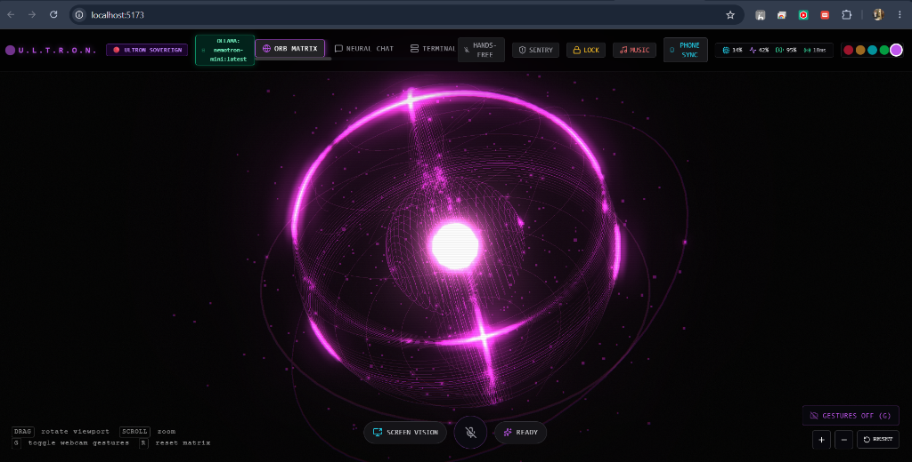

# 🔮 U.L.T.R.O.N. SOVEREIGN OS — Autonomous Spatial AI & Neural Matrix

<div align="center">



### <b>A Top-Tier Industrial Autonomous Spatial AI Desktop Operating System</b>
**Created & Engineered exclusively by Sachindra Pandey for nxt IN Company**

[](https://react.dev/)
[](https://www.typescriptlang.org/)
[](https://threejs.org/)
[](https://vitejs.dev/)
[](https://ollama.com/)
[](https://tailwindcss.com/)

</div>

---

## 🌟 Executive Overview

**ULTRON SOVEREIGN OS** is a futuristic, movie-grade desktop artificial intelligence workstation. It unifies high-performance **Three.js 3D WebGL holographic rendering**, **MediaPipe computer vision gesture tracking**, **ChatGPT-tier local & cloud LLM reasoning**, **autonomous multi-agent swarms**, **full-duplex hands-free voice control**, and **real-time Windows 11 hardware kernel telemetry** into a unified sovereign operating system interface.

---

## 🚀 Core Features & Module Breakdown

### 1. 🌐 3D Holographic Orb Matrix
* **Interactive Three.js Core**: A multi-layered holographic icosahedron nucleus enveloped by tri-axis gyroscopic orbital rings and a 600+ floating particle vortex.
* **Audio-Reactive Dynamics**: Reacts in real-time to microphone audio frequency levels and bass pulsations.
* **6 Futuristic Color Themes**:
  * 🔴 **ULTRON CRIMSON** (`#ff1e42`) — Sovereign core mode
  * 🟡 **J.A.R.V.I.S. GOLD** (`#ffaa30`) — British Butler protocol
  * 🔵 **ARC REACTOR CYAN** (`#00f0ff`) — Stark Industries classic
  * 🟢 **MATRIX EMERALD** (`#00ff66`) — Cybernetic mainframe
  * 🟣 **VOID VIOLET** (`#bf55ec`) — Deep synthwave nebula
  * 🌸 **CYBERPUNK NEON PINK** (`#ff1493`) — High-energy laser matrix
* **MediaPipe Bare-Hand Gesture Tracking**:
  * ✋ **1-Hand Pinch**: Freeform 3D viewport rotation.
  * 👐 **2-Hand Pinch**: Seamless depth zoom in/out.

---

### 2. 💬 Neural Chat Console (ChatGPT-Tier LLM Engine)
* **Zero-Truncation Stream Engine**: Persistent TCP buffer parsing ensures long codebases, essays, and lists never cut off.
* **Automatic Script & Language Mirroring**:
  * 🇮🇳 **Devanagari Hindi**: Pure, grammatically rich Hindi (*"नमस्ते सचिंद्र जी!..."*).
  * 🗣️ **Natural Hinglish**: Smooth, brotherly conversational flow (*"Main badhiya hu Sachindra bhai!..."*).
  * 🇬🇧 **Technical English**: Structured markdown with headers, bullet points, and code blocks.
* **Live Screen Vision (OCR & Diagnostics)**: 1-click desktop screen capture fed into multimodal vision LLM (`moondream:latest`).
* **Movie-Grade Speech Synthesis**: Markdown, backticks, and LaTeX sanitized before passing to native speech synthesis.

---

### 3. 🤖 Autonomous AI Subagent Swarm (Mission Control)
Four specialized background AI agents operate concurrently with real-time thought streams:
* 🕵️ **VERITAS OMNI-RESEARCHER**: Deep multi-step web and factual knowledge synthesis.
* 💻 **DAEDALUS CODE ARCHITECT**: Full-stack code generation, refactoring, and AST analysis.
* 🛡️ **AEGIS NIGHT-WATCH SENTINEL**: Cyber security auditing, vulnerability scanning, and privacy enforcement.
* 📈 **ORACLE DATA & CRYPTO ANALYST**: Real-time market volatility, tokenomics, and data modeling.

---

### 4. 🧠 3D Synaptic Memory Mind-Map Matrix
* **3D Spherical Node Constellation**: 1,500 glowing stars backdrop with interactive 3D nodes arranged in golden-spiral geometry.
* **12 Pre-Seeded Core Enterprise Memories**:
  * Creator Attribution (*Sachindra Pandey for nxt IN Company*)
  * Zero-Bypass Face ID protocols
  * NVIDIA Nemotron & Moondream Vision pipeline
  * In-App YouTube Cyber-Player architecture
  * Dynamic RAG live telemetry hooks
* **Word-Boundary Semantic Recall**: Prevents false positive injections on common greetings.

---

### 5. 💻 Interactive OS Shell & Code Sandbox Runner
* **`>_ OS SHELL` Sub-Tab**: Built-in hacker terminal with diagnostic tools, network pings, and memory purges.
* **`🐍 PYTHON / JS RUNNER` Sub-Tab**:
  * In-browser live execution of Python 3.12 (via Pyodide WASM) and JavaScript (V8 engine).
  * Built-in algorithm presets (Fibonacci Matrix, 3D Particle Generator, SHA-256 Hasher).
  * Millisecond (`ms`) execution timer and live standard output console.

---

### 6. 🎙️ Full-Duplex Hands-Free Voice Mode
* **Ambient Wake-Word Listener**: Always-on background listener for `"Hey Ultron"`, `"Ultron"`, `"Jarvis"`, `"Friday"`.
* **Natural Interruption**: Speaking while Ultron speaks instantly pauses speech synthesis to listen.
* **Auto-VAD**: 1.2s automatic voice activity detection with live speech preview bubble.

---

### 7. 🔒 Zero-Bypass Biometric Face ID Barrier
* **Live 3D Holographic Background**: Facial recognition barrier running atop the live 3D Orb.
* **128-Bin Luminance Biometrics**: Cosine similarity matching unlocks the application in `< 1 second`.
* **Zero Bypass Policy**: No skip buttons — secure biometric gate.

---

### 8. 🎵 Universal In-App YouTube Cyber-Player
* **Zero Tab Redirects**: Streams music directly within the application workspace.
* **Live Autocomplete Search**: Real-time Google YouTube search suggestions dropdown.
* **30+ Curated Artist Vault**: Bollywood, Punjabi, Stark Rock, Hans Zimmer OSTs, and Phonk.
* **Floating Picture-in-Picture (PiP)**: Mini-player overlay accessible across all tabs.

---

### 9. 📊 Real-Time Windows 11 Hardware Telemetry
Native `/api/telemetry` endpoint connected to Windows 11 hardware sensors:
* **CPU Load**: Live dynamic calculation across all 16 cores (Intel Core i5-13450HX).
* **Physical RAM**: Live GB used vs Total 23.7 GB physical memory.
* **Battery & AC Charger**: Real-time percentage via Windows CIM with instant AC plug detection.
* **Network Ping**: Precision browser millisecond latency.

---

### 10. 🌦️ Live Dynamic RAG Context Ingestion
* **Real-Time Satellite Weather**: Exact coordinates for **Varanasi (Kashi)**, Delhi, Mumbai, Bengaluru, and global cities via Open-Meteo.
* **World & Tech News**: Live HackerNews global tech radar feed.
* **Live Crypto Market**: Real-time Bitcoin, Ethereum, and Solana prices via CoinGecko.

---

## 🤖 Supported AI Models Matrix

| Provider | Model Name | Primary Use Case | Execution Mode |
| :--- | :--- | :--- | :--- |
| **Meta (Ollama)** | `llama3.2:latest` (3B) | Conversational reasoning, Hinglish, Hindi, Code | **Offline / Local** |
| **NVIDIA (Ollama)** | `nemotron-mini:latest` (4.2B) | Technical instruction & domain Q&A | **Offline / Local** |
| **Vikhyatk (Ollama)** | `moondream:latest` (1.8B) | Desktop screen capture OCR & visual analysis | **Offline / Local** |
| **Google** | `gemini-2.0-flash` | High-speed multimodal cloud reasoning | Cloud API |
| **Anthropic** | `claude-3-5-sonnet` | Complex architectural design & deep reasoning | Cloud API |
| **OpenAI** | `gpt-4o-mini` / `gpt-4o` | General knowledge & logic | Cloud API |
| **DeepSeek** | `deepseek-chat` | Coding & math problem solving | Cloud API |
| **Groq** | `llama-3.3-70b-versatile` | Ultra-low latency cloud inference (500+ tok/s) | Cloud API |
| **NVIDIA NIM** | `nvidia/llama-3.1-nemotron-70b` | Enterprise-grade cloud AI inference | Cloud API |

---

## 🎙️ Universal Voice Commands Reference

| Voice Command (English / Hinglish) | Executed Action |
| :--- | :--- |
| `"Play [Song / Artist]"` / `"Gana bajao [Song]"` | Streams YouTube music in cyber dock |
| `"Change theme to pink / red / gold / cyan / green / purple"` | Switches 3D Orb theme color |
| `"Open swarm"` / `"Show subagents"` / `"Sab agents"` | Opens AI Subagent Swarm Mission Control |
| `"Open terminal"` / `"Code runner"` | Switches to Terminal & Code Sandbox |
| `"Open memory"` / `"Show mind map"` | Switches to 3D Neural Memory Hub |
| `"Check battery"` / `"Percentage of the charger"` | Returns precise laptop battery level & AC power state |
| `"Scan the system"` / `"System telemetry scan"` | Runs full hardware diagnostic scan (CPU, RAM, Ping) |
| `"Weather in Varanasi"` / `"Mausam kaisa hai"` | Fetches real-time satellite weather report |
| `"Switch to Jarvis"` / `"Act like Jarvis"` | Switches persona to British Butler protocol |
| `"Switch to Ultron"` / `"Act like Ultron"` | Switches persona to Ultron Sovereign core |
| `"Lock system"` / `"Lock screen"` | Engages Biometric Face ID Barrier |
| `"Clear chat"` / `"Purge logs"` | Clears conversation history buffers |

---

## 🛠️ Installation & Setup

### Prerequisites
1. **Node.js**: v18.0 or higher
2. **Ollama**: Installed from [ollama.com](https://ollama.com)
3. **Local Models**:
   ```powershell
   ollama run llama3.2
   ollama pull nemotron-mini
   ollama pull moondream
   ```

### Quickstart

```powershell
# 1. Clone the repository
git clone https://github.com/Sachindrapandeyyy/my-dear-ultron-.git
cd my-dear-ultron-

# 2. Install dependencies
npm install

# 3. Start development server
npm run dev

# 4. Open in browser
# Navigate to http://localhost:5173/
```

### Production Build

```powershell
# Build type-checked production bundle
npm run build

# Preview production build
npm run preview
```

---

## 📂 Project Architecture

```
my-dear-ultron/
├── src/
│   ├── components/
│   │   ├── auth/          # Biometric Face ID Lock Screen
│   │   ├── chat/          # Neural Chat Console with image vision
│   │   ├── harness/       # Soul Presets & AI Model Harness
│   │   ├── hud/           # Top HUD, Telemetry, Voice Controls
│   │   ├── memory/        # 3D Neural Memory Graph & Mind-Map
│   │   ├── music/         # In-App YouTube Cyber-Player Dock
│   │   ├── orb/           # Three.js 3D Holographic Interactive Orb
│   │   ├── swarm/         # Autonomous AI Subagent Swarm Mission Control
│   │   ├── terminal/      # OS Shell & Python/JS Code Sandbox Runner
│   │   └── voice/         # Hands-Free Full-Duplex Voice Controller
│   ├── services/
│   │   ├── audioService.ts        # Sci-Fi sound synthesis
│   │   ├── liveApiService.ts      # Weather, News, Crypto RAG APIs
│   │   ├── llmService.ts          # ChatGPT-tier LLM streaming engine
│   │   ├── memoryService.ts       # 3D Synaptic memory bank
│   │   ├── ollamaService.ts       # Local Ollama endpoint management
│   │   ├── osService.ts           # Hardware telemetry & screen capture
│   │   ├── soulService.ts         # Persona system prompts
│   │   ├── swarmService.ts        # Multi-agent swarm orchestration
│   │   ├── voiceActionService.ts  # Voice command routing engine
│   │   └── voiceService.ts        # Web Speech API & TTS engine
│   ├── store/
│   │   └── useAppStore.ts         # Global Zustand state matrix
│   └── types/
│       └── index.ts               # Complete TypeScript interface definitions
├── docs/
│   └── images/                    # UI screenshots & preview media
├── vite.config.ts                 # Hardware sensor middleware & proxy
└── package.json
```

---

<div align="center">

### **ULTRON SOVEREIGN OS**
<sub>Designed, Architected, and Engineered by **Sachindra Pandey** for **nxt IN Company**</sub><br>
<sub>© 2026 nxt IN Company. All rights reserved.</sub>

</div>
